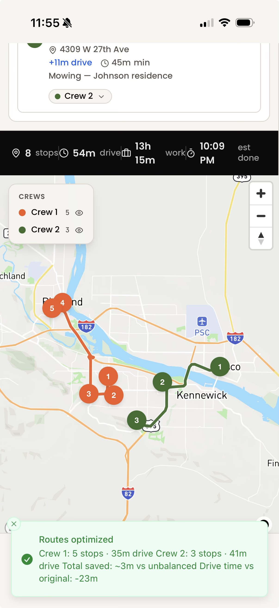
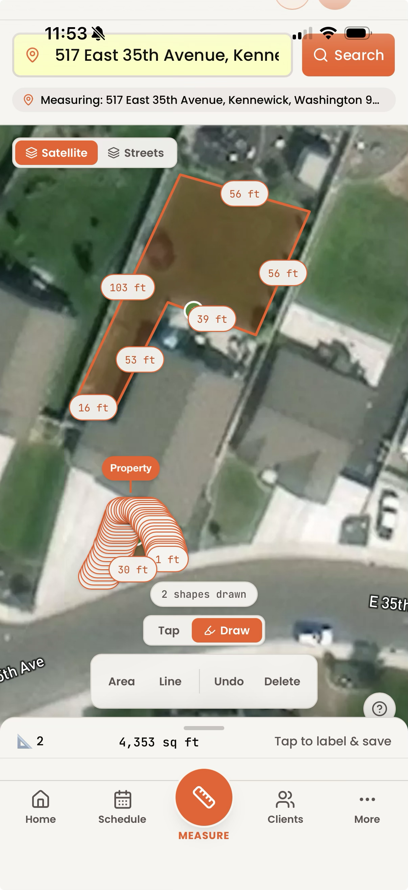
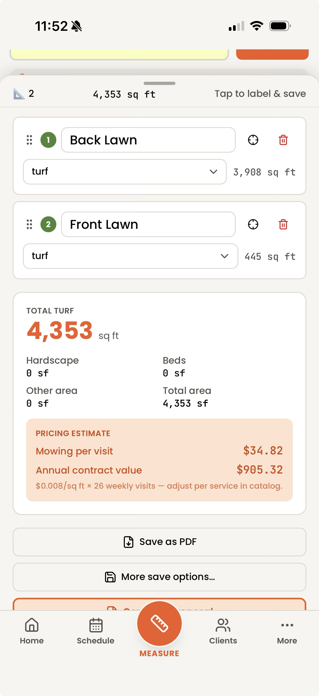
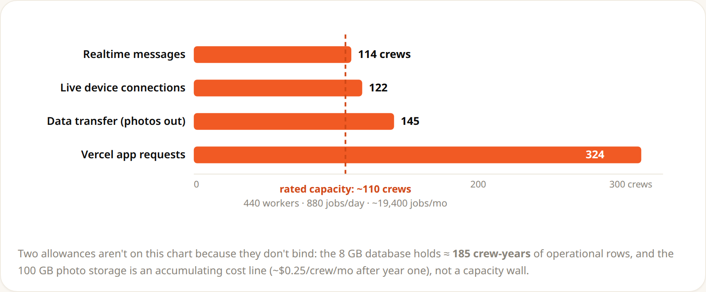
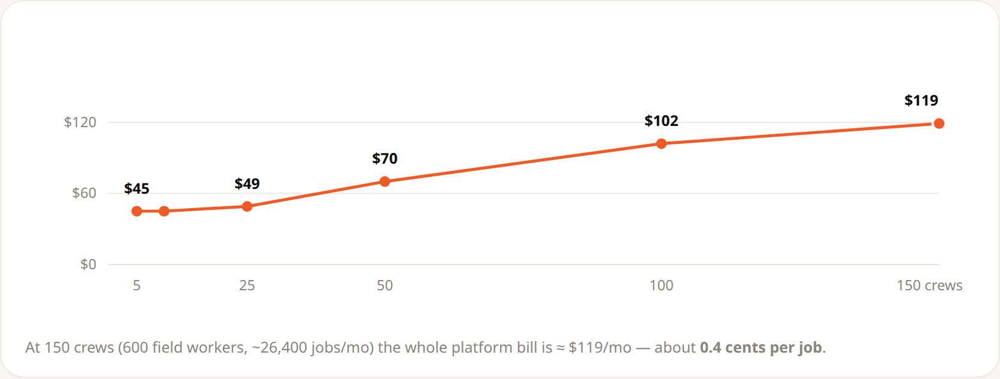
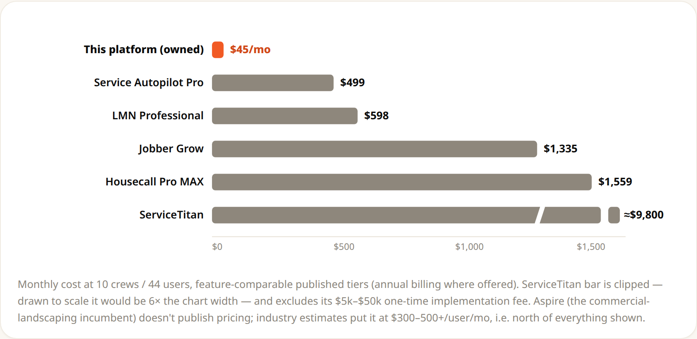

# TLC Management Platform

**The complete field-service operating system for a landscaping company — built by Watt Systems.**

Estimating → e-signed proposals → optimized routes → a crew app that works with no signal → geofenced payroll → invoices → collections. One platform, every role, from the first quote to the deposited check.

🔗 **Live:** [greenops-rho.vercel.app](https://greenops-rho.vercel.app) · **Stack:** Next.js 16 · Supabase (Postgres + RLS) · Vercel · Mapbox · VROOM


---

## A day on the platform

The best way to understand this app is to follow the work through it — because that's how it's built: one continuous loop from quote to cash.

### 🌅 7:00 AM — The office builds the day

The dispatcher opens **Schedule** and drags jobs onto crew lanes — day, week, or month view, live-synced across every open screen. Then one click into the **Route Builder**, and the optimizer earns its keep:

<p>
  
</p>

- **One-click route optimization** (VROOM engine) sequences every stop for minimum drive time — across *multiple crews simultaneously*. In the shot above it split 8 stops between two crews, balanced their workloads, and cut **23 minutes of drive time** off the original order — the toast tells you exactly what it saved.
- It honors per-job **hard time windows** and **skill certifications**: a job with a restricted service (say, spraying) can only land on a crew certified for it. Uncertifiable jobs surface in a loud banner instead of silently vanishing.
- Each crew's route draws in its own color with numbered stops; the summary bar totals stops, drive time, work time, and an **estimated done-by clock** for the whole day.
- Optimized drive order and leg times are written back to each job, so crews see stops in true drive order with real ETAs between them (*"+11m drive"* on every stop card).
- **Dispatch** sends the day to every crew phone.

### 📡 7:30 AM — Dispatch goes live

The **Dispatch board** is mission control: who's clocked in, where every truck is (GPS pins refresh every 30 seconds while a job is running), and what's in progress — updating in real time as the day unfolds. Crew heading to the next stop? The customer-facing ETA comes from live GPS.

### 📱 8:00 AM — A crew member's whole day fits on a phone

<p>
  
  &nbsp;
  
  &nbsp;
  
</p>

The crew app is an installable PWA — no app store, no training curve:

- **Morning brief**: weather, roster, drive-ordered stops. Tap *Start My Day* and the shift clock starts.
- **Geofenced clock-in**: the punch is checked against the client's actual coordinates. In range? Invisible. Out of range? The worker confirms with a reason and the punch lands *flagged for office review* — honest payroll without hard-blocking anyone over rural GPS drift.
- **Pre-job form gating**: required safety/site checklists must be submitted before the clock-in button unlocks.
- **Completion flow**: before/after photos, materials & expenses with receipt shots, a real customer signature drawn on glass, notes — all committed in a **single atomic transaction**. There is no such thing as a half-completed job in this system.
- **✈️ Works with zero signal.** Lose coverage mid-job and nothing changes: photos, signature, and notes queue on the device and sync *exactly once* when coverage returns — the airplane-mode scenario is a permanent automated test, not a promise.
- One job done → auto-forwarded to the next stop. All jobs done → an **End of Day** summary with hours, miles, and proof-of-work counts.

### 🧪 The spray job — compliance that sells commercial contracts

For pesticide/fertilizer work (a legal record-keeping requirement in WA):


- Product catalog with **EPA registration numbers**, active ingredients, and re-entry intervals straight off the label
- **Applicator license registry** with 30/7-day expiration warnings — an expired license *blocks* application logging
- Crews log applications in the field with **weather auto-captured** at application time; the re-entry window computes automatically
- Customers see *"safe to re-enter after…"* in their portal; crews get warned if a property is still inside a re-entry window
- **One-click WSDA report export** for any date range — the exact artifact an inspector asks for

### 💰 The money loop — where this platform pays for itself

**Proposals customers can sign from their couch.** Build a quote with the pricing engine (property complexity, slopes, frequency discounts, per-visit vs monthly billing), hit *Send*, and the client gets a no-login link: they review, **draw their signature, and accept** — timestamped with name and IP. You get notified instantly; one click converts the proposal into scheduled recurring jobs (six months of occurrences, materialized automatically, forever after by cron).

**Billing that runs itself.** Recurring invoices generate on schedule with per-contract tax rates and atomic per-company invoice numbering. Payments recompute balances through database triggers — no reconciliation drift, ever.


- **AR Aging** is the collections worklist: every open balance bucketed *current / 1–30 / 31–60 / 61–90 / 90+*, worst debtors on top, drill-down to invoices, CSV for the accountant.

**Payroll from punches, automatically.**


- Pay-week timesheets roll up from real clock events: regular vs **overtime past 40h**, per-job shift breakdowns, open-punch warnings (never silently inflate payroll)
- The flagged-punch queue shows the distance and the worker's own reason — approve in one tap
- **Payroll CSV** exports in a Gusto/ADP-ready shape

**Every completed job knows its margin.** Labor (rates + burden), materials with receipts, equipment, and overhead recompute per-job profit via triggers. The **Profitability** view names your most and least profitable clients, services, and crews — with honest "can't compute" states instead of fabricated margins.

### 🏡 Meanwhile, the customer is in their own portal

<p>
  
  &nbsp;
  
</p>

Each client gets a branded self-service portal: next scheduled service, **request-a-quote** in three taps, two-way messaging with the office, issue reporting with photos, full job history with before/after proof and signatures, invoices, and chemical re-entry safety notices. Everything they submit lands in the office **Portal Inbox** with live notifications both directions.

### 📐 4:00 PM — Quote the next property without leaving the truck

<p>
  
  &nbsp;
  
</p>

The **Measure tool** is the sales weapon: pull up any address on satellite imagery and draw the property — turf areas, beds, hardscape, fence lines — tap-to-place points or a freehand highlighter, with **every edge length labeling live in feet** as you draw. Name each shape ("Back Lawn — 3,908 sq ft"), and the totals roll up by surface type. A **pricing estimate computes right on the screen** — per-visit and annual contract value from your per-sqft rates — before you've saved anything. PDF snapshot is one click.

Then the part that closes deals: **one tap sends the measurement into the proposal builder**, where every measured square foot is pre-applied against your per-sqft service rates — a fully priced, line-itemed proposal generated from a satellite drawing, before you've set foot on the lawn. Send the e-sign link, and the customer can accept it the same afternoon.

Crews get the same tool in the field: a *Measure this property* deep-link on every job page, so a customer's "while you're here, what would mulch cost?" turns into a measured, priced upsell on the spot.

---

## 💪 The badass features, in one list

| Feature | Why it makes money |
|---|---|
| **E-sign proposals** (no-login link, drawn signature, view tracking) | Quotes close from the couch instead of dying in voicemail |
| **Multi-crew route optimization** (VROOM + skills + time windows) | Less windshield time = more jobs per truck per day |
| **Offline-proof crew app** (atomic completion, exactly-once sync) | Rural properties stop costing you paperwork and proof |
| **Geofenced timesheets → payroll CSV** | Payroll takes minutes and punches are verified by GPS |
| **AR Aging report** | Who owes what, how badly, sorted — collections stops being guesswork |
| **Chemical compliance suite** (EPA/WSDA, licenses, REI) | Wins commercial/HOA contracts that require the paper trail |
| **Live GPS dispatch board** | "Where's the crew?" answered without a phone call |
| **Per-job profit tracking** (auto-recomputed) | Kill the clients and services that lose money |
| **Customer portal** | Fewer calls, faster quote requests, proof-of-work on record |
| **Measure tool** (satellite draw + live area math) | Quote turf/beds by the square foot without a site visit |
| **Measure → auto-priced proposal** (one tap) | A satellite drawing becomes a signed contract the same day |

## 📏 Capacity — how much operation this runs on $45/mo

Modeled from the app's *measured* write patterns (30-second GPS pings, full-resolution photo uploads, per-job event counts) against stock **Supabase Pro ($25/mo) + Vercel Pro ($20/mo)** allowances. Working unit: a 4-person crew completing 8 jobs/day, 22 days a month.

**Headline: ~110 crews · 440 field workers · 880 jobs/day (~19,400/mo) before the first included limit — and that limit is a billing line, not a wall.** A full crew-year adds ~37 MB to an 8,000 MB database allowance; structured data is never the constraint.



| Crews | Field workers | Jobs/day | Jobs/month | Photo storage growth | Est. infra cost/mo |
|---:|---:|---:|---:|---:|---:|
| 5 | 20 | 40 | 880 | 4.8 GB/mo | **$45** |
| 10 | 40 | 80 | 1,760 | 9.5 GB/mo | **$45** |
| 25 | 100 | 200 | 4,400 | 24 GB/mo | **$49** |
| 50 | 200 | 400 | 8,800 | 48 GB/mo | **$70** |
| 100 | 400 | 800 | 17,600 | 95 GB/mo | **$102** |
| 150 | 600 | 1,200 | 26,400 | 143 GB/mo | **$119** |



At 150 crews the entire platform bill is ≈ $119/mo — about **0.4¢ per completed job**. Figures are modeled (not load-tested) from published plan allowances; database compute upgrades (~$15/mo past ~50 crews) are included in the curve.

## 🥊 What the market charges for the same job

Published 2026 list prices for the leading field-service platforms, modeled at a **10-crew operation (44 users)** on feature-comparable tiers. This platform has no per-seat license — its cost is the infrastructure bill above.



| Platform | Pricing model | 3 crews (14 users) | 10 crews (44 users) | 25 crews (107 users) | 5-yr cost @ 10 crews |
|---|---|---:|---:|---:|---:|
| **This platform (owned)** | Infra only — no seats | **$45** | **$45** | **$49** | **~$2,700** |
| Service Autopilot | Flat tiers $279–849 | $499 | $499 | $849 | ~$30,000 |
| LMN | Flat tiers $297–697 | $598 | $598 | $697 | ~$36,000 |
| Jobber | $349/10 users + $29/user | $465 | $1,335 | $3,162 | ~$80,000 |
| Housecall Pro | $299/8 users + $35/user | $509 | $1,559 | $3,764 | ~$94,000 |
| ServiceTitan | ~$245–500/technician | ~$2,940 | ~$9,800 | ~$24,500 | ~$590,000 + setup |
| Aspire | Custom (unpublished) | — | *est. $300–500+/user/mo* | — | — |

**The framing:** this isn't a subscription — it's the asset that replaces one. A 10-crew operation displaces $6,000–$115,000/yr of SaaS spend while paying ~$540/yr in infrastructure, keeps its data in its own Postgres, and pays no per-seat tax to grow.

<sub>Prices as of July 2026, annual billing where offered, add-ons excluded on all sides: [Jobber](https://www.getjobber.com/pricing/) · [Housecall Pro](https://www.housecallpro.com/pricing/) · [Service Autopilot](https://www.serviceautopilot.com/pricing/) · [LMN](https://golmn.com/pricing/) · [ServiceTitan](https://www.servicetitan.com/pricing) · [Aspire](https://www.youraspire.com/aspire-plans) · plan allowances: [Supabase](https://supabase.com/pricing), [Vercel](https://vercel.com/pricing).</sub>

## 🏗️ Architecture notes a reviewer will care about

- **Multi-tenant by construction**: every table carries `company_id` with Postgres **row-level security** across all 57 migrations — verified by automated cross-tenant probe tests (customers can't see other clients, staff data, GPS, or costs; write attacks bounce)
- **Private media with signed-URL proxy**: job photos/signatures live in private buckets, served through an authorization-checking route (staff by company, customers only for their own jobs)
- **Atomic field operations**: job completion is a single Postgres RPC — status, clock-out, photos, signature, activity log commit or roll back together, with a double-submit guard
- **Offline queue**: completions persist to IndexedDB (photo/signature blobs included) with idempotent replay; small mutations queue in localStorage
- **One notification spine** (`notifyStaff` / `notifyCustomer`) ready for email/SMS providers to plug into a single file
- **Per-tab company context cache** kills the auth waterfall — pages fetch data immediately instead of re-resolving identity on every navigation

## ✅ Tested like it matters

- **33 end-to-end Playwright tests** against a real local Supabase — including a full **crew-day simulation at phone size** (brief → geofenced clock-in → two completions → dispatch verification → timesheets → EOD), an **airplane-mode offline test** (two jobs completed offline sync exactly once), and a **portal round-trip** (request → office queue → status → customer notification → two-way messaging)
- **94 unit tests** on the money math: timesheet/OT splits, AR aging buckets, license expiry thresholds, re-entry intervals, proposal pricing, WSDA CSV escaping
- Every deploy: typecheck, lint, build, full suite

## 🛠️ Tech stack

Next.js 16 (App Router) · React 19 · TypeScript · Supabase (Postgres, Auth, RLS, Realtime, Storage) · Tailwind CSS v4 + shadcn/ui · Mapbox GL + Turf · VROOM/OpenRouteService · OpenWeatherMap · react-hook-form + zod · Playwright + Vitest · Vercel (crons included)

## 🏃 Local development

**Prerequisites:** Node 18+, Docker, Supabase CLI

```bash
git clone https://github.com/CWatt250/greenops.git
cd greenops
npm install

supabase start              # local Postgres + Auth + Storage
cp .env.example .env.local  # fill in keys
supabase db reset           # run all migrations + seeds

npm run dev                 # http://localhost:3000
```

- Supabase Studio: `http://127.0.0.1:54323`
- Tests: `npm run test:unit` · `E2E_PORT=3100 npm run test:e2e` (see `TESTING.md`)
- Prod migrations: `supabase db push` (migration history is fully in sync)
- Deploys: every push to `main` auto-deploys on Vercel

## 👥 User roles

| Role | Login lands on | Access |
|---|---|---|
| `owner` | `/dashboard` | Everything |
| `dispatcher` | `/dashboard` | Everything except settings |
| `crew` | `/today` | Mobile crew app |
| `customer` | `/portal` | Their own portal only |

## 🗺️ Roadmap

See [`ROADMAP.md`](ROADMAP.md) — shipped items are marked. The next unlock (transactional email: invoice delivery, dunning ladders, review requests) is one provider API key away; the dispatch layer for it is already built.

---

## 📍 About TLC Landscape Management

TLC Landscape Management is the leading landscape management provider in the Tri-Cities, WA (Kennewick, Richland, Pasco) — serving residential, commercial, and HOA clients since 2017.

🌐 [tlclandscapemanagement.com](https://tlclandscapemanagement.com) · 📞 (509) 627-9384 · 📍 1053 S Highland Dr, Kennewick, WA 99337

## 📄 License

Private — built exclusively for TLC Landscape Management.
