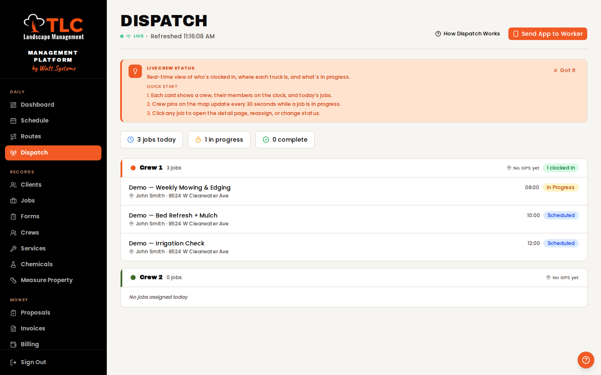
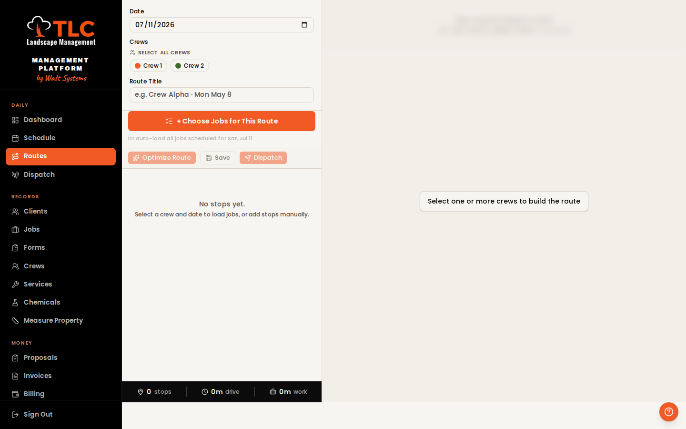
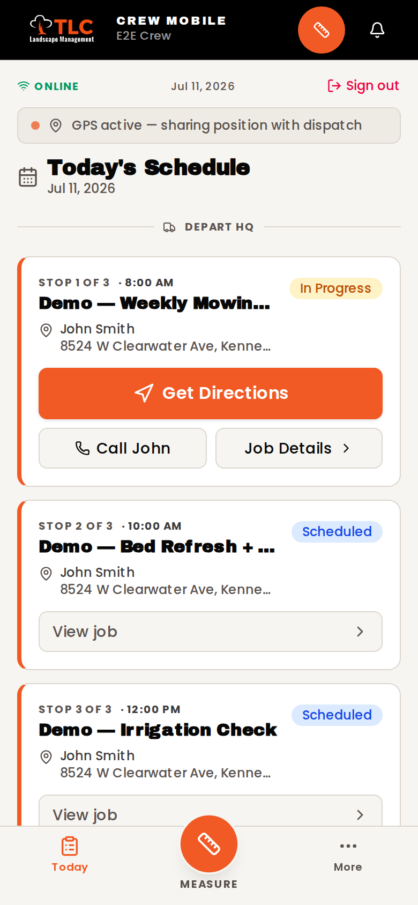
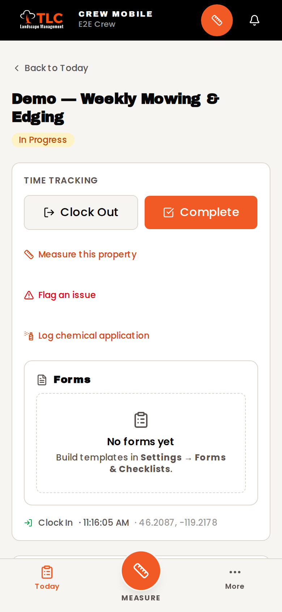
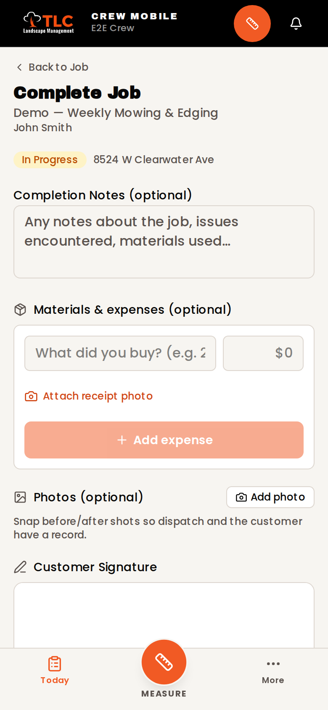
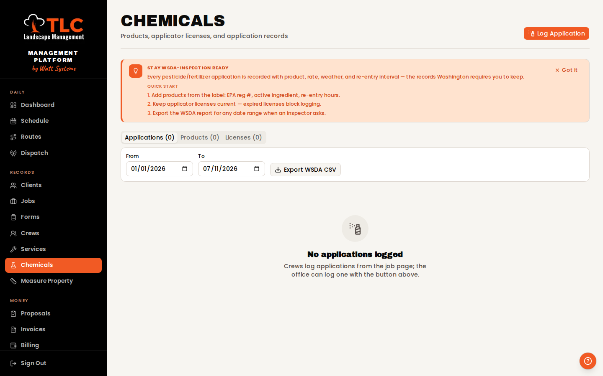
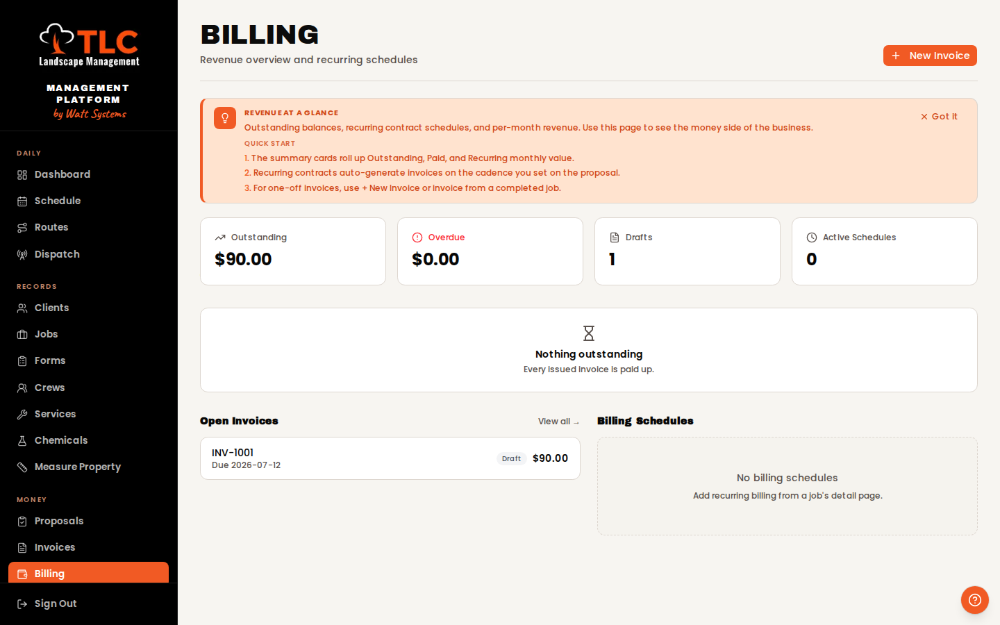
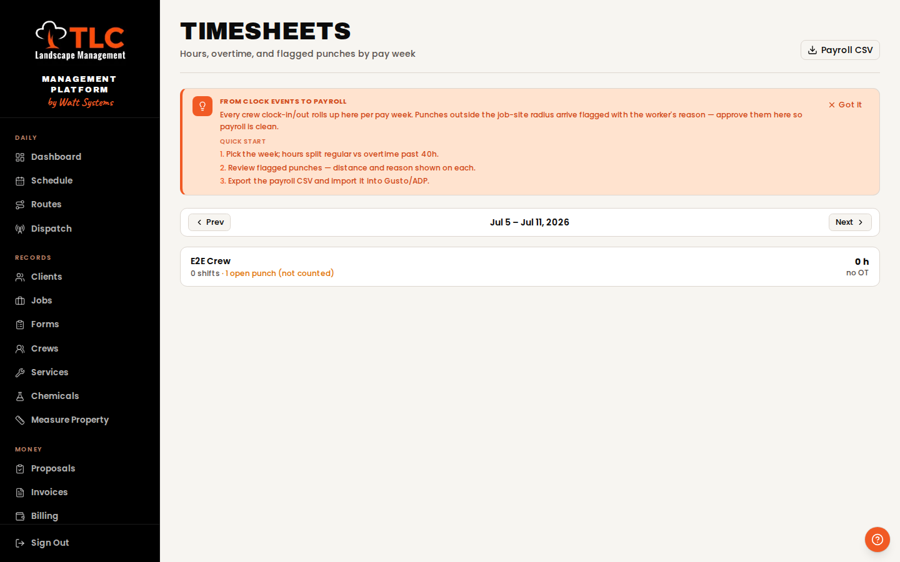
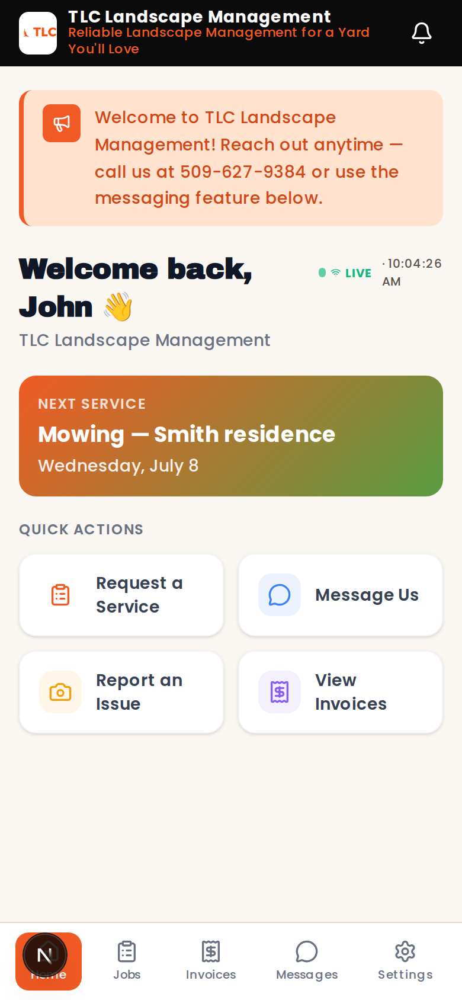
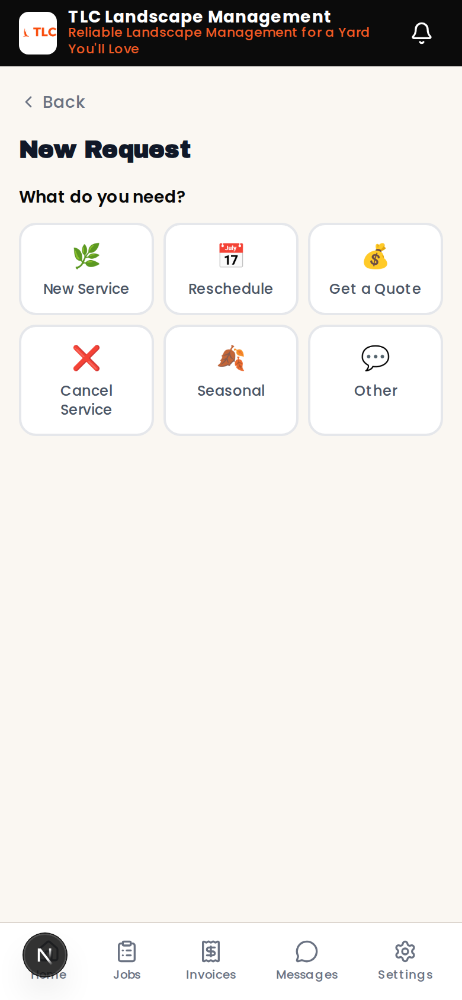

# TLC Management Platform

**The complete field-service operating system for a landscaping company — built by Watt Systems.**

Estimating → e-signed proposals → optimized routes → a crew app that works with no signal → geofenced payroll → invoices → collections. One platform, every role, from the first quote to the deposited check.

🔗 **Live:** [greenops-rho.vercel.app](https://greenops-rho.vercel.app) · **Stack:** Next.js 16 · Supabase (Postgres + RLS) · Vercel · Mapbox · VROOM



---

## A day on the platform

The best way to understand this app is to follow the work through it — because that's how it's built: one continuous loop from quote to cash.

### 🌅 7:00 AM — The office builds the day

The dispatcher opens **Schedule** and drags jobs onto crew lanes — day, week, or month view, live-synced across every open screen. Then one click into the **Route Builder**:



- **One-click route optimization** (VROOM engine) sequences every stop for minimum drive time — across *multiple crews simultaneously*, balancing workloads, honoring per-job **hard time windows**, and respecting **skill certifications**: a job with a restricted service (say, spraying) can only land on a crew certified for it. Uncertifiable jobs surface in a loud banner instead of silently vanishing.
- Optimized drive order and leg times are written back to each job, so crews see stops in true drive order with real ETAs between them.
- **Dispatch** sends the day to every crew phone.

### 📡 7:30 AM — Dispatch goes live

The **Dispatch board** is mission control: who's clocked in, where every truck is (GPS pins refresh every 30 seconds while a job is running), and what's in progress — updating in real time as the day unfolds. Crew heading to the next stop? The customer-facing ETA comes from live GPS.

### 📱 8:00 AM — A crew member's whole day fits on a phone

<p>
  
  &nbsp;
  
  &nbsp;
  
</p>

The crew app is an installable PWA — no app store, no training curve:

- **Morning brief**: weather, roster, drive-ordered stops. Tap *Start My Day* and the shift clock starts.
- **Geofenced clock-in**: the punch is checked against the client's actual coordinates. In range? Invisible. Out of range? The worker confirms with a reason and the punch lands *flagged for office review* — honest payroll without hard-blocking anyone over rural GPS drift.
- **Pre-job form gating**: required safety/site checklists must be submitted before the clock-in button unlocks.
- **Completion flow**: before/after photos, materials & expenses with receipt shots, a real customer signature drawn on glass, notes — all committed in a **single atomic transaction**. There is no such thing as a half-completed job in this system.
- **✈️ Works with zero signal.** Lose coverage mid-job and nothing changes: photos, signature, and notes queue on the device and sync *exactly once* when coverage returns — the airplane-mode scenario is a permanent automated test, not a promise.
- One job done → auto-forwarded to the next stop. All jobs done → an **End of Day** summary with hours, miles, and proof-of-work counts.

### 🧪 The spray job — compliance that sells commercial contracts

For pesticide/fertilizer work (a legal record-keeping requirement in WA):



- Product catalog with **EPA registration numbers**, active ingredients, and re-entry intervals straight off the label
- **Applicator license registry** with 30/7-day expiration warnings — an expired license *blocks* application logging
- Crews log applications in the field with **weather auto-captured** at application time; the re-entry window computes automatically
- Customers see *"safe to re-enter after…"* in their portal; crews get warned if a property is still inside a re-entry window
- **One-click WSDA report export** for any date range — the exact artifact an inspector asks for

### 💰 The money loop — where this platform pays for itself

**Proposals customers can sign from their couch.** Build a quote with the pricing engine (property complexity, slopes, frequency discounts, per-visit vs monthly billing), hit *Send*, and the client gets a no-login link: they review, **draw their signature, and accept** — timestamped with name and IP. You get notified instantly; one click converts the proposal into scheduled recurring jobs (six months of occurrences, materialized automatically, forever after by cron).

**Billing that runs itself.** Recurring invoices generate on schedule with per-contract tax rates and atomic per-company invoice numbering. Payments recompute balances through database triggers — no reconciliation drift, ever.



- **AR Aging** is the collections worklist: every open balance bucketed *current / 1–30 / 31–60 / 61–90 / 90+*, worst debtors on top, drill-down to invoices, CSV for the accountant.

**Payroll from punches, automatically.**



- Pay-week timesheets roll up from real clock events: regular vs **overtime past 40h**, per-job shift breakdowns, open-punch warnings (never silently inflate payroll)
- The flagged-punch queue shows the distance and the worker's own reason — approve in one tap
- **Payroll CSV** exports in a Gusto/ADP-ready shape

**Every completed job knows its margin.** Labor (rates + burden), materials with receipts, equipment, and overhead recompute per-job profit via triggers. The **Profitability** view names your most and least profitable clients, services, and crews — with honest "can't compute" states instead of fabricated margins.

### 🏡 Meanwhile, the customer is in their own portal

<p>
  
  &nbsp;
  
</p>

Each client gets a branded self-service portal: next scheduled service, **request-a-quote** in three taps, two-way messaging with the office, issue reporting with photos, full job history with before/after proof and signatures, invoices, and chemical re-entry safety notices. Everything they submit lands in the office **Portal Inbox** with live notifications both directions.

---

## 💪 The badass features, in one list

| Feature | Why it makes money |
|---|---|
| **E-sign proposals** (no-login link, drawn signature, view tracking) | Quotes close from the couch instead of dying in voicemail |
| **Multi-crew route optimization** (VROOM + skills + time windows) | Less windshield time = more jobs per truck per day |
| **Offline-proof crew app** (atomic completion, exactly-once sync) | Rural properties stop costing you paperwork and proof |
| **Geofenced timesheets → payroll CSV** | Payroll takes minutes and punches are verified by GPS |
| **AR Aging report** | Who owes what, how badly, sorted — collections stops being guesswork |
| **Chemical compliance suite** (EPA/WSDA, licenses, REI) | Wins commercial/HOA contracts that require the paper trail |
| **Live GPS dispatch board** | "Where's the crew?" answered without a phone call |
| **Per-job profit tracking** (auto-recomputed) | Kill the clients and services that lose money |
| **Customer portal** | Fewer calls, faster quote requests, proof-of-work on record |
| **Property measurement** (satellite draw + area math) | Quote turf/beds by the square foot without a site visit |

## 📏 Built to scale (and cheap to run)

Modeled from the app's real write patterns against stock **Supabase Pro + Vercel Pro** ($45/mo total): **~110 crews / 440 field workers / ~19,400 jobs a month** before the first metered limit — and that limit is a billing line, not a wall. A full crew-year adds ~37 MB to the database. At 150 crews the entire infra bill is ≈ $119/mo — about **0.4¢ per completed job**. Compare: feature-equivalent SaaS tiers run $500–$1,600/mo at 10 crews (Jobber/Housecall Pro per-seat pricing) — this platform has **no per-seat anything**.

## 🏗️ Architecture notes a reviewer will care about

- **Multi-tenant by construction**: every table carries `company_id` with Postgres **row-level security** across all 57 migrations — verified by automated cross-tenant probe tests (customers can't see other clients, staff data, GPS, or costs; write attacks bounce)
- **Private media with signed-URL proxy**: job photos/signatures live in private buckets, served through an authorization-checking route (staff by company, customers only for their own jobs)
- **Atomic field operations**: job completion is a single Postgres RPC — status, clock-out, photos, signature, activity log commit or roll back together, with a double-submit guard
- **Offline queue**: completions persist to IndexedDB (photo/signature blobs included) with idempotent replay; small mutations queue in localStorage
- **One notification spine** (`notifyStaff` / `notifyCustomer`) ready for email/SMS providers to plug into a single file
- **Per-tab company context cache** kills the auth waterfall — pages fetch data immediately instead of re-resolving identity on every navigation

## ✅ Tested like it matters

- **33 end-to-end Playwright tests** against a real local Supabase — including a full **crew-day simulation at phone size** (brief → geofenced clock-in → two completions → dispatch verification → timesheets → EOD), an **airplane-mode offline test** (two jobs completed offline sync exactly once), and a **portal round-trip** (request → office queue → status → customer notification → two-way messaging)
- **94 unit tests** on the money math: timesheet/OT splits, AR aging buckets, license expiry thresholds, re-entry intervals, proposal pricing, WSDA CSV escaping
- Every deploy: typecheck, lint, build, full suite

## 🛠️ Tech stack

Next.js 16 (App Router) · React 19 · TypeScript · Supabase (Postgres, Auth, RLS, Realtime, Storage) · Tailwind CSS v4 + shadcn/ui · Mapbox GL + Turf · VROOM/OpenRouteService · OpenWeatherMap · react-hook-form + zod · Playwright + Vitest · Vercel (crons included)

## 🏃 Local development

**Prerequisites:** Node 18+, Docker, Supabase CLI

```bash
git clone https://github.com/CWatt250/greenops.git
cd greenops
npm install

supabase start              # local Postgres + Auth + Storage
cp .env.example .env.local  # fill in keys
supabase db reset           # run all migrations + seeds

npm run dev                 # http://localhost:3000
```

- Supabase Studio: `http://127.0.0.1:54323`
- Tests: `npm run test:unit` · `E2E_PORT=3100 npm run test:e2e` (see `TESTING.md`)
- Prod migrations: `supabase db push` (migration history is fully in sync)
- Deploys: every push to `main` auto-deploys on Vercel

## 👥 User roles

| Role | Login lands on | Access |
|---|---|---|
| `owner` | `/dashboard` | Everything |
| `dispatcher` | `/dashboard` | Everything except settings |
| `crew` | `/today` | Mobile crew app |
| `customer` | `/portal` | Their own portal only |

## 🗺️ Roadmap

See [`ROADMAP.md`](ROADMAP.md) — shipped items are marked. The next unlock (transactional email: invoice delivery, dunning ladders, review requests) is one provider API key away; the dispatch layer for it is already built.

---

## 📍 About TLC Landscape Management

TLC Landscape Management is the leading landscape management provider in the Tri-Cities, WA (Kennewick, Richland, Pasco) — serving residential, commercial, and HOA clients since 2017.

🌐 [tlclandscapemanagement.com](https://tlclandscapemanagement.com) · 📞 (509) 627-9384 · 📍 1053 S Highland Dr, Kennewick, WA 99337

## 📄 License

Private — built exclusively for TLC Landscape Management.
